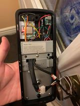
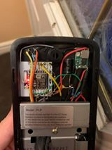
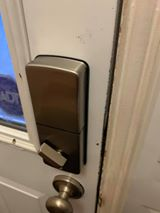
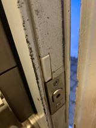

# Door Locks - PowerBolt2 Hacks #

#### Status: Completed - In Service ####

#### Devices: ESP8266-07, mini360, reed switch ####

### Description: ###
I already had a PowerBolt2 from Weiser on my front door, so I decided to crack it open and see if I was able to control it in parallel to the original circuit. It ended it was possible as the main controller pushes 3.3V through a 47k resistpr to a N-FET transistor. So all I had to do is to push 3.3V through another 47k to the transistor's gate. In order to control properly, I also had to acquire the signals from the 2 or 3 limit switches (PowerBolt2 has 2 different version of the gearing, both are addressed in this code, simply change the "#define SOLID_GEAR false"). It also manages right or left door lock through MQTT JSON.

Finally bought more for other doors (side door and garage entrance door)

 

### Features: ###
- Solid gear (3 limit-switches) and non-solid gear (2 limit switches) are both addressed
    - Change the "#define SOLID_GEAR false" in the file
- Addesses the right/left locking through JSON
- Uses the existing limit switches to control the same way the original does
- Magnetic reed switches for door open/close detection
- Powered through a 6V 2A power adapter and a mini360 for 3.3V
    - Doesn't use battery even for the motor
    - Keyless entry works if there's a power outage, but wifi module won't work

#### Outcome ####
Device works very great
A real PCB will be built to replace bulky wires and make things nicer and safer.

### Home Assistant Link: ###
- MQTT device with QoS and LWT

#### Credits & 3D printing
- None
