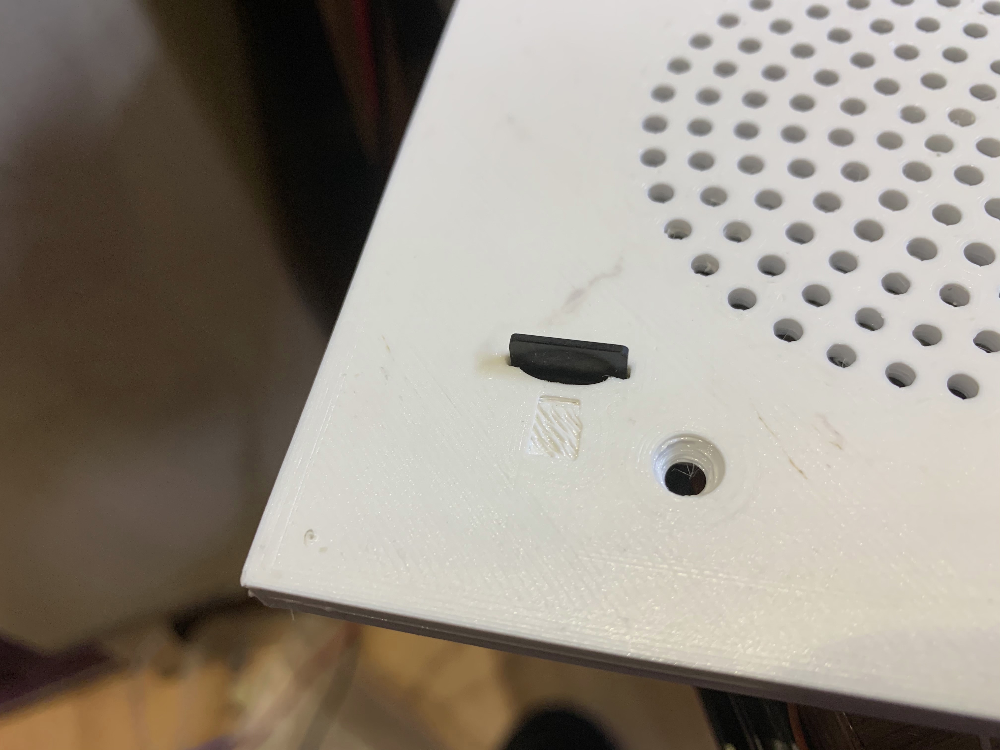

# Door Bell & Chime #

#### Status: Completed - In Service ####

#### Devices: ESP8266-07, Arduino Nano, mini360 ####

### Description: ###
My door bell has never worked since I got in my home. So after over 5 years and at least 3 with all the parts in hands, I finally gave it a go and got it done and working. It's made of an ESP8266 for communication to Home Assistant and a nano that drive the sound using PWM module on pin #9.

 

### Features: ###
- SD card reader connected to an Arduino Nano
    - Included hardcoded ding-song sound
    - Included hardcoded star wars song
        - Used when SD card fails or not present
    - Plays WAV audio files encoded 8000kHz, 8bit, mono
        - all files must be named aa.wav up to ju.wav in order to not reprogram Arduino Nano
        - Indexing from 1=aa to 255=ju is already programmed [see Excel File here](https://github.com/SupremeSports/HA-Domotic/tree/master/Devices/Doorbell%20%26%20Chime/Arduino/src/Audio%20Files)
- ESP8266 used to communicate through wiFi to Home Assistant
- I2C communication between ESP8266 and Arduino Nano
- Simple Class A amplifier
    - One 2N7000 for audio PWM from pin #9 of the arduino
    - One TIP125 for speaker enable as the speaker emits random noises from powerline, etc.
- 3D printed speaker grill with integrated SD card slot

#### Outcome ####
Device works very great, but some sounds doesn't get out very good. Might eventually place an mp3 player or try to get better sounds
A real PCB will be built to replace bulky wires and make things nicer and safer.

### Home Assistant Link: ###
- MQTT device with QoS and LWT

#### Credits & 3D printing
- Grill: [SupremeSports](https://www.thingiverse.com/thing:4247530)
