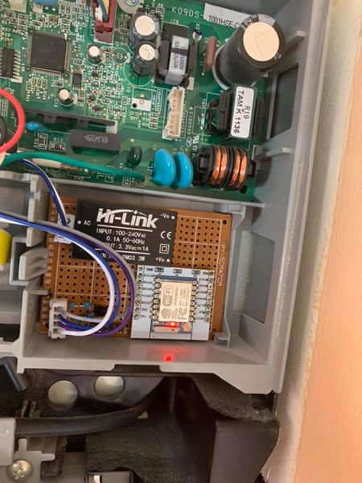
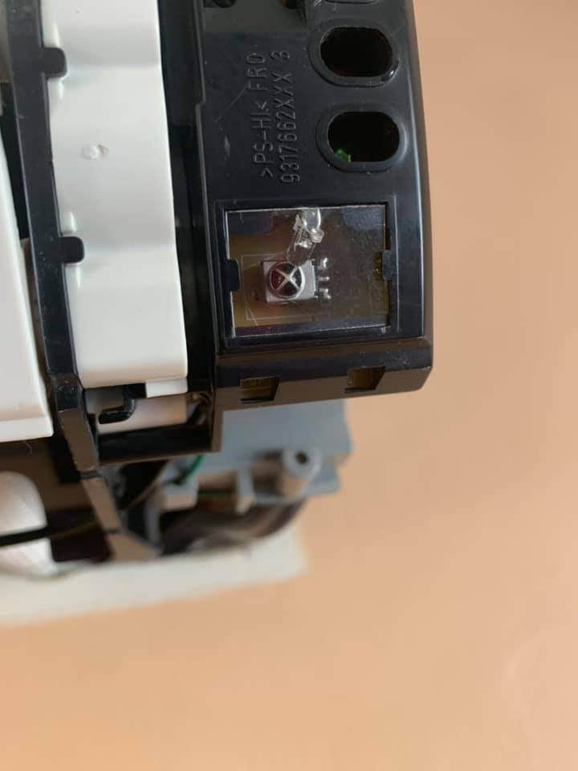
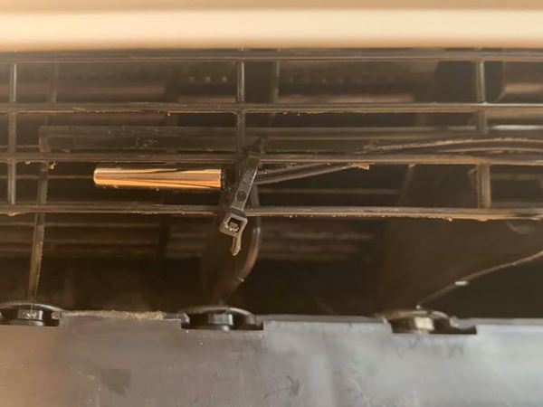

# HVAC - Living Room #

#### Status: Completed - In Service ####

#### Devices: ESP8266-07, HLK-PM03, 10k NTC ####

### Description: ###
My door bell has never worked since I got in my home. So after over 5 years and at least 3 with all the parts in hands, I finally gave it a go and got it done and working. It's made of an ESP8266 for communication to Home Assistant and a nano that drive the sound using PWM module on pin #9.

### Features: ###
- HLK-PM03 3.3V 1W power supply directly on 240Vac
- 940nm IR LED to communicate as the original remote
- Extra temp sensor to read the output temperature (NOT room temperature)
- Special library for Fujitsu AC units has been used
    - Will need to be adapted to your own AC unit
    - **Unless you have the EXACT same unit and expescially remote as I do, it WON'T work**

#### Outcome ####
Device works very great
A real PCB will maybe be built to replace bulky wires and make things nicer and safer.

### Home Assistant Link: ###
- MQTT device with QoS and LWT

#### Credits & 3D printing
- IR Remotes Library: [crankyoldgit](https://github.com/crankyoldgit/IRremoteESP8266)
