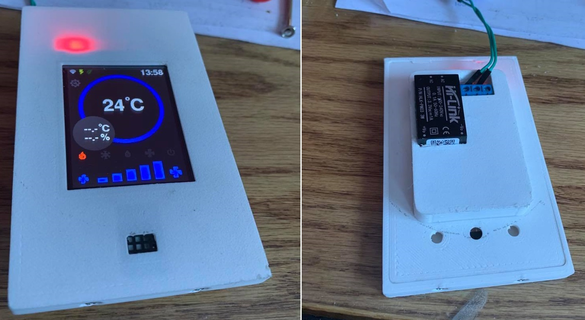
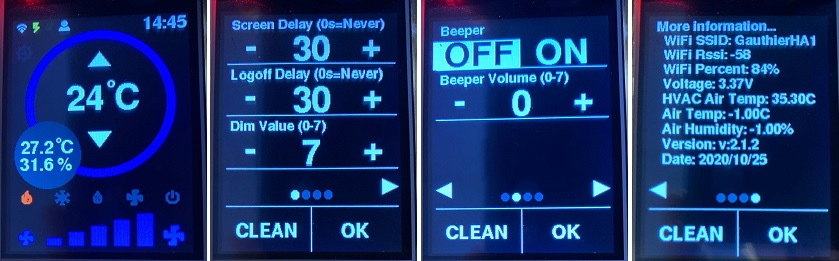

# Thermostat - HVAC and heaters #

#### Status: In developement ####

#### Devices: ESP32, HLK-PM03, AM2320/DHT22 ####

### Description: ###
Needed a thermostat to read room temperature in order to control the HVAC/Heaters accordingly.
The 2.4" TFT touchscreen replaces the HVAC remote control and communicates with my [Living HVAC](https://github.com/SupremeSports/HA-Domotic/tree/master/Devices/Heaters%20and%20Thermostats/Living%20HVAC).
The 2.4" TFT touchscreen will be eventually deployed to all my rooms to get temp/humidity and eventually control heaters.
It also replicates [Home Assistant climate](https://www.home-assistant.io/integrations/climate/) options onto the screen.
The basics are from [AZ-Touch](https://www.hwhardsoft.de/english/projects/arduitouch-esp/) and I simply used parts of their code in order to make mine. Many features added, some others removed.

### Features: ###
- HLK-PM03 3.3V 3W power supply directly on 100-240Vac
- 3.3/5V protected with
- Passcode protected settings and temperature modification (disables and/or hides buttons)
- Passcode can be changed through MQTT and saved to EEPROM
- Logout and screen timeout adjustable through the settings screen
- Settings screen to adjust screen turn off delay, logout delay, dim level, beeper level
- Extra screen to show information (WiFi SSID, rssi, voltage, etc.)
- Communicating with Home Assistant and HVAC directly through the MQTT broker
- 5V bus monitoring (if installed with AMS1117-3.3) or 3.3V monitoring if installed with HLK-PM03 with J1 jumped
- XPT2046_Touchscreen.h library modified to add VBat readin and internal temperature monitoring [waiting on pull request](https://github.com/PaulStoffregen/XPT2046_Touchscreen/pull/37)
    - In the meantime, please use my included library files

- Top row:
    - Displays WiFi status, HVAC on/off status, ECO mode, user logged in and notifications icons
    - Displays time
- Center ring:
    - Displays set temperature in large
    - Arrow up/down (disappears when logged out) adjusts temperature
        - Displayed in red until you let it at new temprature for few seconds, then sends it to MQTT
- Left gray circle:
    - Displays actual temperature and humidity as read by the AM2320/DHT22
- Right gray circle: (not done yet)
    - Arrow up/down (disappears when logged out) adjusts tilt
- Symbols row:
    - Copied directly from the [HA Thermostat card](https://www.home-assistant.io/lovelace/thermostat/) symbols for Heat/Cool/Humidity/Fan/Off
    - Shows in color when selected, grayed out when not
- Bottom fan:
    - Displays level for a fan 
        - Please note that I reused the 5 levels to fit with my HVAC level (Auto/Quiet/Low/Medium/High)
    - In heater-only mode (not HVAC), it would be for the room ceiling fan [See Maestro dimmer/fan](https://github.com/SupremeSports/HA-Domotic/tree/master/Devices/Maestro%20Wall%20Dual%20Dimmer)

#### Outcome ####
Bench tests are very satisfying, first prototype working, waiting on few more parts to come in mail...

To come...

#### Features for future:
- Modify the code for easy switch between an HVAC and a normal heater preventing maintaining two codes - working on it in next weeks
- Finalize 3D printed enclosure for perfect finish, look and functionality

### Home Assistant Link: ###
- MQTT device with QoS and LWT

#### Credits & 3D printing
- Base code: [AZ-Touch](https://www.hwhardsoft.de/english/projects/arduitouch-esp/)
- 3D printed case: [SupremeSports](https://www.thingiverse.com/supremesports/designs) - To come...
- Thermostat card: [HA Thermostat card](https://www.home-assistant.io/lovelace/thermostat/)
- Base for touch screen: [XPT2046_Touchscreen](https://github.com/PaulStoffregen/XPT2046_Touchscreen)
