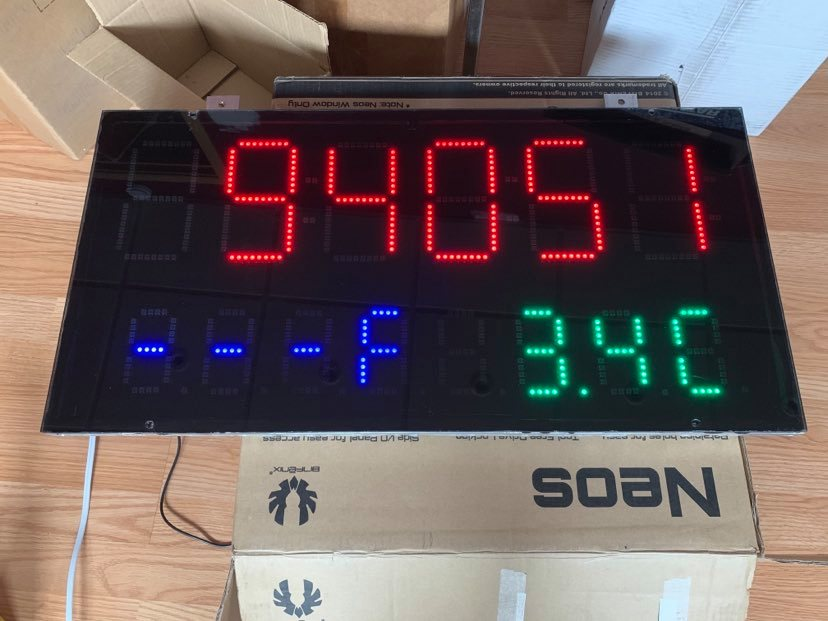
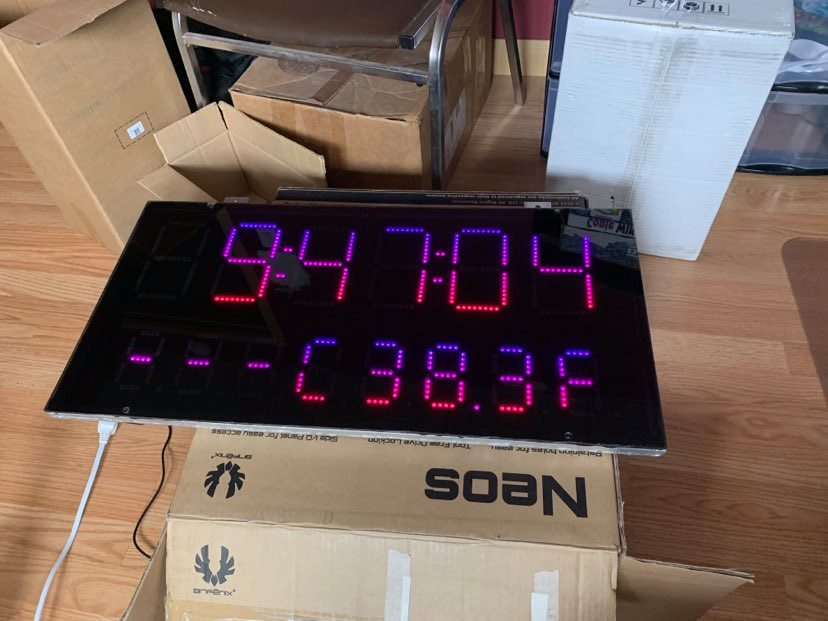
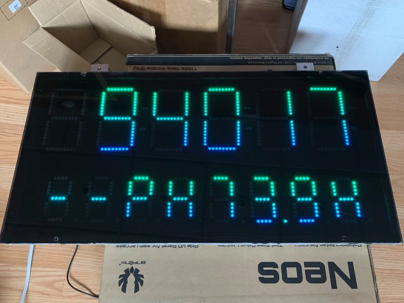

# Pool Clock #

#### Status: Completed - In Service ####

#### Devices: ESP8266, WS2812, Logic Level Converter ####

### Description: ###
Based on the neo pixels chips WS2812 5050, I purchased 8m of LED strips with 144LEDs/meter.

#### Features: ####

- Displays actual time (hh:mm:ss)
- Can display text scrolling instead, but will still display time every minute for 10 seconds (Slots mode)
- Internal RTC to keep time and updates from MQTT once every 5 minutes
- Includes actual outdoor temperature/humidity/humidex (°C/°F) using weather station (or other source in HA)
- Includes actual pool water temperature (°F/°C), water pH (later, water ORP (chlorine level))
    - Updated once per minute, scrolls through all of them within 10 seconds
- Auto dim with light intensity from the weather station (UV sensor) (To do)
- Fully integrated with Home Assistant's MQTT JSON Light and you can control on/off, brightness, color, effects and color cycle speed
    - Added Home Assistant input_text to control text on displays (some letters not available such as M, W, etc.)
    - Added a scroll speed control using input_number scroll bar and passes the value through the JSON command. Controls the scroll speed of the text.

#### Credits
- Neo7segment.h:   [UnexpectedMaker](https://github.com/UnexpectedMaker/Neo7Segment)

The initial library neo7segment.h has been modified by me to adjust the number of pixels per segment and has now been merged to master. The original library gave the possibility to adjust the number of digits, but not the quantity of pixels per segment. Since I wanted a very large clock display (8 pixels per segment) and 4 pixels digits for the outdoor temperature/humidity and for the pool water temperature, I had to modify the library to suite my needs.
