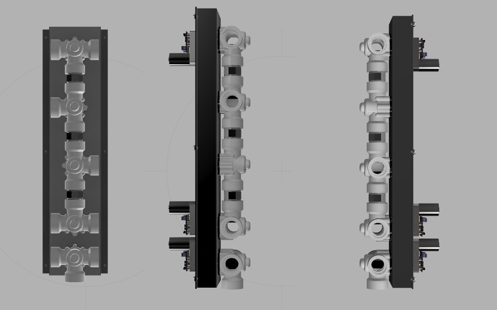
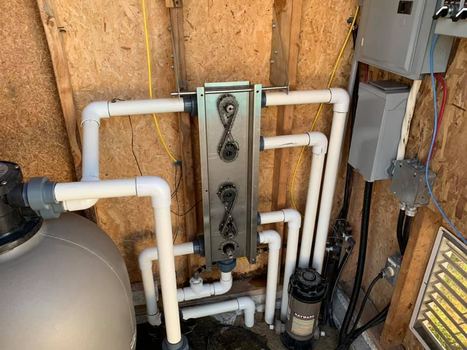

# Pool Valves Controller:

#### Main controller :  Arduino Mega 2560 with ENC28J60
#### Status: Mostly Completed - Not in service 

### Description:
I wanted a way to adjust water flow of my pool remotely, so I designed a valve controller able to rotate PVC pool valves using a servo motor. I found some heavy duty 180kg.cm @ 24Vdc (90kg.cm @ 12Vdc) used in very large RC planes. those servos are able to rotate 270°

#### Design

*Step file is included for anyone who would like to replicate and/or adapt to his situation

#### Skimmer/Drain controller
Main valve is to control source (suction) going to the pump, this one needs a 180° rotation. It goes from Full skimmer to 50/50 to full drain (never passing over pump inlet). This valve is directly drived by the servo.

#### Heater controller
Control to heatpump is pretty important as it must be derived when shocking the pool water or if pH gets too low. This would prevent damage to heat exchanger. Most new heatpumps have a titanium heat exchanger which would support almost everything without damages, but if your heater has more than 5 years, exchanger is most likely made out of copper or plated copper. Any pH lower than 7.0 or a shock treatment would definitely damage your heat exchanger and will eventually fail.

Normally, a setup of 3x 2-way valves bypass is used, but with 3-way valves tied together, you can have only 2. The reason you wouldn't set a 2x 3-way valve controlled manually is that you don't want to block water flow risking damages to plumbing or pump.

I made an H splitter for it, both valves has to rotate 90° but in different direction. I put a set of sprocket with a chain (probably overkill size, but that's all my local shop had in hand). The chain has to be placed in a 8 shape as pictured here:

#### Slide control
At first, this was supposed to control flow toward solar heater panels. After much consideration, calculations and logic, my location is not optimal for solar heater and would have cost so much for so few benefits. I decided to upgrade my heatpump instead. So, there's a bypass installed for the slide, but chain will be removed, servo adjusted for 180° and will have a spot to add an extra servo for whatever reason I may need in the future.

#### Features:
- Control water circulation valves position with servos

### Home Assistant Link:
- MQTT device with QoS and LWT
- Receives all data once per second
- Adjusts icon's colors depending on current status

#### Features for future:
- Add buttons for easy selection instead of using my phone when hands full of water
  
### Credits & 3D printing
I 3D printed the lamacoids for the selector switches
