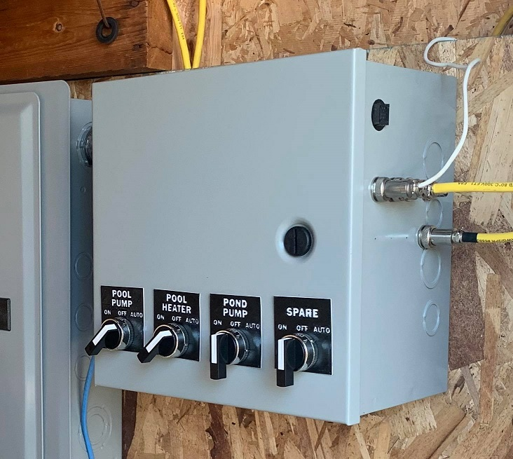
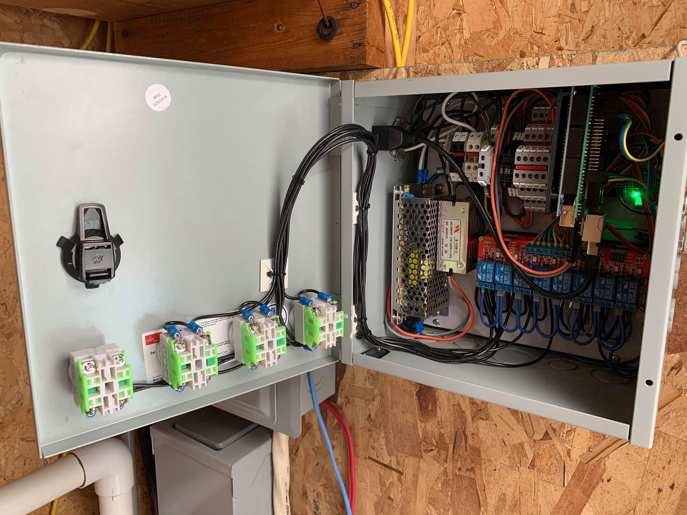

# Pool controller:

#### Main controller :  Arduino Mega 2560 with ENC28J60
#### Status: Mostly Completed - In Service

#### Features:
- Pool pump control
  - Dual speed controlled depending on time of day
  - Manual selector switch to force on, force off or auto mode
    - Easy start stop for backwash and other operations
  - Pool pump temperature
- Pool heatpump
  - Controls heat pump depending on time of day and temperature setpoint
- Water control
  - Dual level verification 
    - OK level for automatic refill
    - Critical level for pump shutoff
  - Water temperature
  - Water temperature after heatpump
  - pH sensor (not physically installed yet)
  - Water Pressure transducer 0.5V to 4.5V
    - Got issues with it as it got destroyed in chlorine water. So will repurchase a new one and add a gauge guard (diaphragm seal)
- Circulation valves
  - Control water circulation valves position with servos
- Others
  - Garden watering valve
  - Pond pump control (to be moved to independant control)
- Pool cabin
  - Reads power supply voltages (5V and 12V)
  - Pool cabin temperature/humidity - AM2320
  - Pool control box temperature/humidity - AM2320
  - Pool cabin door opened
  - Pool cabin door locked status
  - Power usage

### Home Assistant Link:
- MQTT device with QoS and LWT
- Receives all data once per second
- Adjusts icon's colors depending on current status

#### Features for future:
- Read chlorine and pH level 
  - Automatically control the levels
- Remove pond control as it will have it's own controller
- Pool lighting RGBW with neopixels
  
### Credits & 3D printing
I 3D printed the lamacoids for the selector switches

