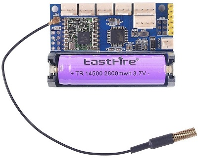
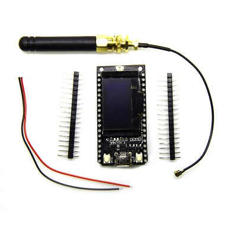

# Postal Detection #

#### Status: Completed - In Service ####

#### Devices: Arduino Pro Mini LoRa SX1276, LoRa32 SX1276, photodiode for door sensing ####

### Description: ###
My mail arrives in a community mailbox approximately 300ft down the street. 
- When I work from home, I don't know if the mail has passed that day.
- When I work at the office, I often stop and check for nothing at lunch time and if it has already passed and I have no mail, I have to stop again at the end of the day because I don't know if there was simply no mail for me that day or if it was delivered after lunch.
- If my wife stopped during the day and already collected the mail, I won't know, so I stop for nothing.

So I decided to create a mailbox transmitter that would send a signal when mail is delivered, and a different signal when mail is collected. The sender module will be installed inside the dark brown metallic community mailbox which has to support any type of temperatures from -40°C to 40°C (probably up to 80°C inside in summer sun). Also, as the mailbox is metallic, no need to continuously transmit.

A LoRa communication is well suited for this task.

#### Sender Module ####
The sender module is an arduino pro mini 3V3 8MHz module with a 14500 Li-Ion 3.7V battery integrated with a SX1276 LoRa 915MHz module. It is in deepsleep mode all the time and wakes up on an interrupt. Interrupts are only available on pin D2 & D3 of the arduino pro mini, but on this module, only pin D3, D4, A0 & A1 are available, leaving only pin D3 for interrupt. Using a diode from pin D4 (Cathode) to pin #3 (Anode), whenever pin D3 or D4 is on, it triggers the interrupt. So, there's only one way to control this. The pin D3 is connected to my private door and pin D4 to the main door that the mailman opens. When he opens the main door, it also opens my private door, triggering the interrupt. When the interrupt is triggered, module reads which door is open, the Vcc voltage and increment a unique transmition ID, creates a string, encrypts and sends it through LoRa signal, saves ID to EEPROM then goes to sleep again.

***UPDATE:***
A new version has been implemented because the mailman kept breaking (involuntarily) the wires to the reed switches or the reed switches kept falling (can't be screwed in the mailbox has it's not my property). The diode remained in place in order to get enough current to drive a photo diode. The photo diode is connected directly to pin D3 and triggers the interrupt as soon as there's light in the mailbox. As soon as the door is opened, the LoRa transmits a "NO MAIL" message since it can't transmit a message after door closed, so we send the no mail message right away. If the door remains open for more than 20 seconds, it sends a "NEW MAIL" message.

The photodiode version has few cons:
- Doesn't trigger if you check your mail after sunset (e.g.: evening) or if outside light is dimmed (e.g.: very cloudy);
- If the mailman opens the door for less than 20s, doesn't trigger the "NEW MAIL" message;
- If the new message has been sent and the mailman puts stuff in your mailbox enough to retrigger the sensor, it will automatically resend a no mail message. This has been fixed by adding a timer in the receiver; "NEW MAIL" has to be on for more than 5 minutes before accepting a "NO MAIL" message;
- If you open your mailbox for more than 20s, it will detect new mail;

The pros are:
- No more ripped wires or fallen reed switch;
- Almost invisible as it is held by strong magnets to the far top right of the mailbox;

To activate this function, a simple define has been set:
    #define LDR                     true

#### Receiver Module ####
The receiver module is a LoRa32 TTGO with a white 0.96" OLED display which features an ESP32 along with a SX1276 LoRa 915MHz module. It is running continuously on WiFi connected to the HomeAssistant interface through MQTT. It stores ID, Vcc and Status in EEPROM, this allows it to remember the values on power up without needing new data from the sender.

It features an OLED display that shows data on receive then shuts down after few seconds.

#### Outcome ####
Device works great even though, since the photodiode modification, sometimes I'm not getting the signal when new mail has arrived (probably not open long enough) and when I collect mail at the end of the day in winter, it doesn't detect it (I use my phone light to trigger it)

BUT, overall, it's a great device/feature to add to an home automation. I love this device.

### Features: ###
- The sender device sends an encrypted signal through 915MHz LoRa signal
- The receiver stores data to keep HomeAssistant with latest data

### Home Assistant Link: ###
- MQTT device with QoS and LWT
- Receives all data from the receiver module through JSON attributes
- Home Assistant keeps memory of the last arrival and removal date/time
- User can manually change the status from the interface

### 3D printed parts available on Thingiverse: ###
- [Sender Module](https://www.thingiverse.com/thing:3593743)
- [Receiver Module](https://www.thingiverse.com/thing:3593785)
